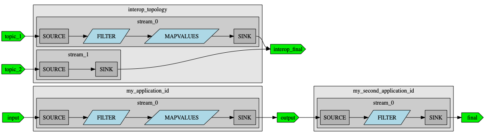
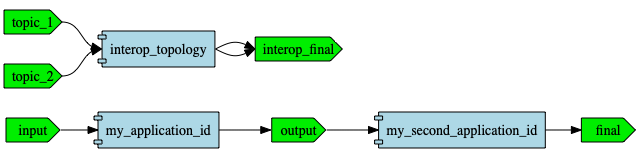

# Sample topology

This project contains a few sample topologies that can be used to demonstrate the capabilities of the topology-grapher library.

From this directory start a repl with `clj` and check the [demo.clj namespace](./src/demo.clj) to try it out yourself.

This project also uses `hawk` to automatically regenerate graphs from the topologies, so whenever you edit a [jackdaw topology](./src/jackdaw_topology.clj) or a [raw interop topology](./src/interop_topology.clj) the graphs will re-generate.

When you generate the graphs you would get something like this:

